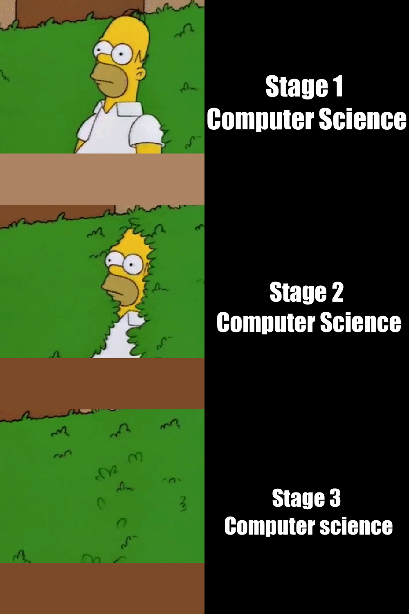

# Hello people! Below is my original meme
## The meme that I have created is something all computer science students have faced, initially when they do the first stage papers, eg compsci 101, generally most people find these papers easier, as you go through the stages, the papers become exponentially harder.

### The Meme is original and new as its something that has never been created before. I had to manually extract the frames from this GIF image shown below and then pick the appropriate images to use.

https://www.google.com/url?sa=i&url=https%3A%2F%2Fgiphy.com%2Fexplore%2Fhomer-bushes&psig=AOvVaw0Yw-AWlNIAgxJmJNwIiQU2&ust=1647600075335000&source=images&cd=vfe&ved=0CAsQjRxqFwoTCLjekub6zPYCFQAAAAAdAAAAABAD




## R Code Below!

```r
library(magick)

picture_1 <- image_read("https://www.thehypeoutlet.com/wp-content/uploads/2022/03/one.gif") %>%
  image_scale(500)

picture_2 <- image_read("https://www.thehypeoutlet.com/wp-content/uploads/2022/03/5.gif") %>%
  image_scale(500)

picture_3 <- image_read("https://www.thehypeoutlet.com/wp-content/uploads/2022/03/12.gif") %>%
  image_scale(500)

picture_1_text <- image_blank(width = 500, 
                          height = 500, 
                          color = "#000000") %>%
  image_annotate(text = "Stage 1 \nComputer Science",
                 color = "#FFFFFF",
                 size = 65,
                 font = "Impact",
                 gravity = "center")

picture_2_text <- image_blank(width = 500, 
                         height = 500, 
                         color = "#000000") %>%
  image_annotate(text = "Stage 2\n Computer Science",
                 color = "#FFFFFF",
                 size = 60,
                 font = "Impact",
                 gravity = "center")

picture_3_text <- image_blank(width = 500, 
                       height = 500, 
                       color = "#000000") %>%
  image_annotate(text = "Stage 3\n Computer science",
                 color = "#FFFFFF",
                 size = 55,
                 font = "Impact",
                 gravity = "center")

first_row <- c(picture_1, picture_1_text) %>%
  image_append()

second_row <- c(picture_2, picture_2_text) %>%
  image_append()

third_row <- c(picture_3, picture_3_text) %>%
  image_append()

final<-c(first_row, second_row, third_row) %>%
  image_append(stack = TRUE)

final

image_write(final, "mymeme.png")


```


